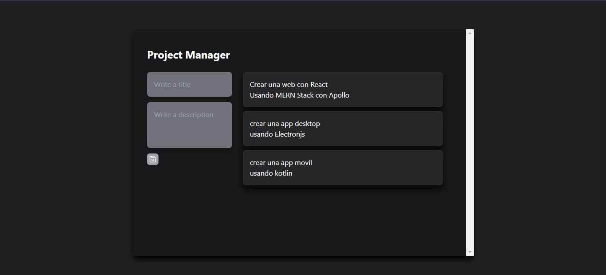
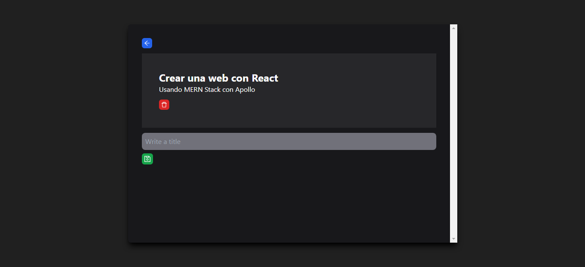
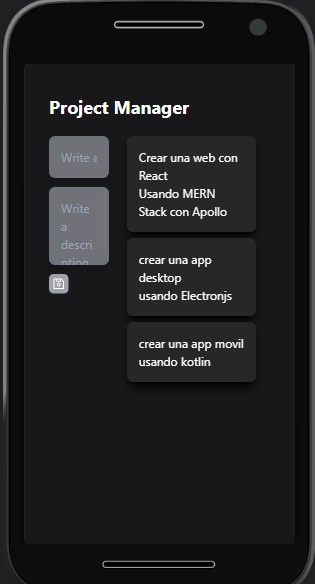
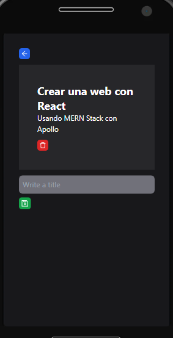

# MERN GraphQL desde cero

## Descripción

Código base del proyecto MERN GraphQL desde cero utilizando Apollo client.

---

## Vista En Versión Desktop

## Vista En Versión Mobile

---

## Comandos

- npm i
- npm run dev
- npm run build

## Dependencias

- Apollo client
- GraphQL
- React
- React DOM
- React Icons
- React Router DOM

## Dependencias De Desarrollo

- Autoprefixer
- Prettier
- Prettier Plugin Tailwind CSS
- Post CSS
- Tailwind CSS
- Vite
